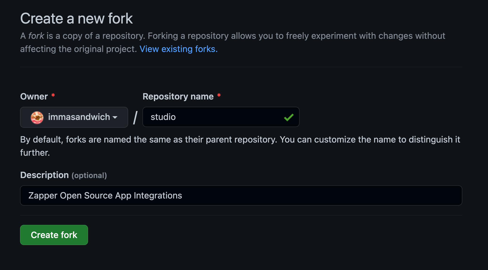

# Getting Started

In this guide, we are going to integrate [Pickle Finance](https://pickle.finance/) as a Zapper application from scratch.

## What is Pickle?

**Pickle** is cross-chain a yield aggregator application that uses **vaults** to auto-compound yield of your underlying tokens.

For example, at the time of writing, you could deposit your **CVX/ETH** pool tokens from **Curve** into a Pickle Jar on Ethereum Mainnet. The jar employs a strategy to deposit these tokens into the **Convex** yield farm, periodically harvest the yield, and buy/stake more pool tokens. As a result, the compounded APY becomes almost **35%**!

Similarly, opportunities for aggregating yield exist on other chains as well. On **Polygon**, you can deposit your **QI/MATIC** tokens from **QuickSwap** in the same way.

## Fork the Zapper.fi Studio Repo

Visit the [Zapper Studio](https://github.com/Zapper-fi/studio) GitHub repository, then click the **Fork** button at the top-right.

You'll fork this repository to your personal namespace, then create your branch under this fork.



Clone the repository to your local machine, then create a new branch to capture your changes.

## Generate your app folder

Use the provided CLI to bootstrap most of the application code required for building an integration. In a new terminal window, run:

```sh
yarn studio create-app
```

You will be prompted to enter the **name**, **unique identifier** (generated by default as the lower-kebab-case variant of your app's name), **description**, and **URL**, and the supported **networks** for this application.

Once completed, you'll see new files generated under `src/apps/<app_id>` in your repo. We'll begin by exploring the definition file in the following section.
